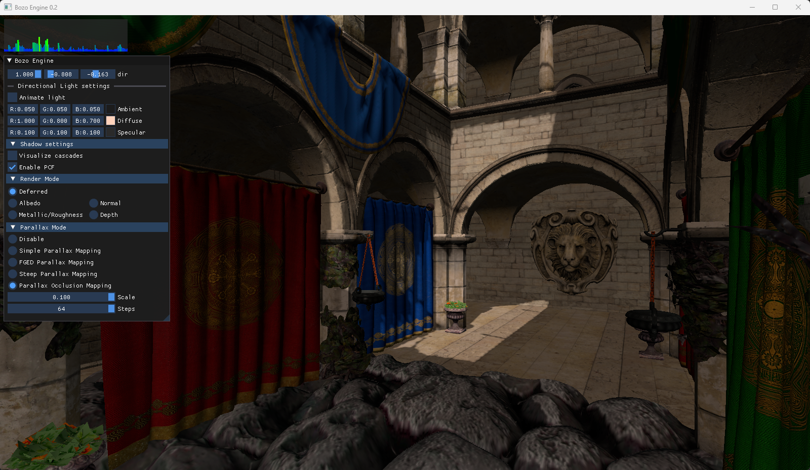

# Bozo Engine 🤡
Small `Vulkan 1.3` hubby renderer written in c++ from scratch. The goal of BozoEngine is to gain some hands-on experience with Vulkan, try out some game engine programming and learn how rendering real-time rendering techniques are implemented. Most importantly, however, it's (allegedly suppossed to, at some point, become) fun!

The Vulkan API abstraction is heavily inspired by the design described by Sebastian Aaltonen in his [REAC2023 presentation](https://enginearchitecture.org/downloads/reac2023_modern_mobile_rendering_at_hypehype.pdf). Eric Lengyel's FGED series of books have also served as a guide for the implementation of rendering techniques like shadow mapping.

## Features
- Cascaded shadow mapping. Based on the implementation described in Eric Lengyels FGED2.
- Basic deferred renderer. Albedo, normal, depth, metal/roughness are written to a gbuffer but proper materials / PBR has not been implemented yet.
- Implementations of various parallax mapping techniques such as POM.
- Cubemapped skybox (rewrite in progress).
- Reversed depth buffering for better precision.
- Very basic point lights + directional lights.
- Very basic support for rendering glTF 2.0 models through [tinygltf](https://github.com/syoyo/tinygltf).
- Small custom [Dear ImGui](https://github.com/ocornut/imgui) vulkan backend for use with `dynamic_rendering`.

## Dependencies
Bozo Engine uses the following 3rd party libraries:
- Window handeling with [glfw](https://github.com/glfw/glfw)
- Math stuff with [glm](https://github.com/g-truc/glm)
- Image loading with `stb_image.h` from [stb](https://github.com/nothings/stb)
- glTF model loading with [tinygltf](https://github.com/syoyo/tinygltf)
- ImGUI with [Dear ImGui](https://github.com/ocornut/imgui)
- SPIR-V reflection with [SPIRV-Cross](https://github.com/KhronosGroup/SPIRV-Cross)
- Vulkan meta-loader [volk](https://github.com/zeux/volk)
- [VMA](https://github.com/GPUOpen-LibrariesAndSDKs/VulkanMemoryAllocator) is used for Vulkan memory allocations.
